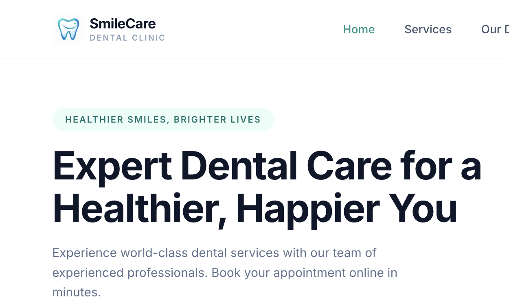
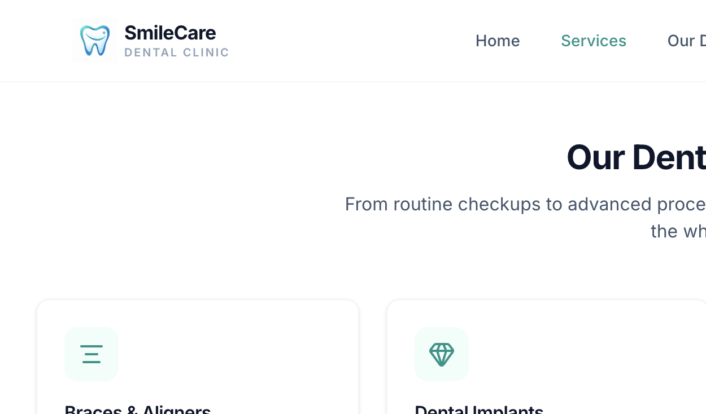
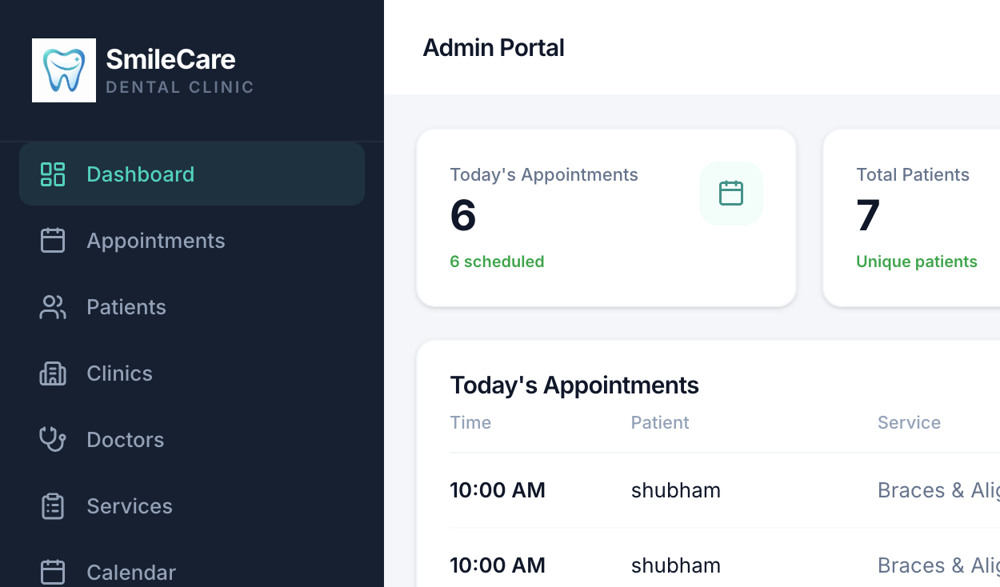
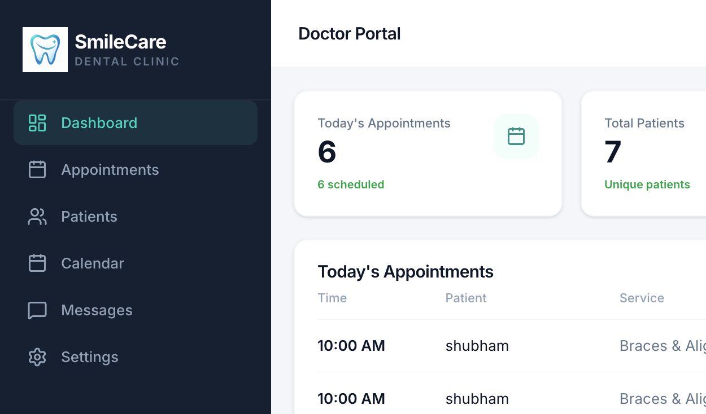
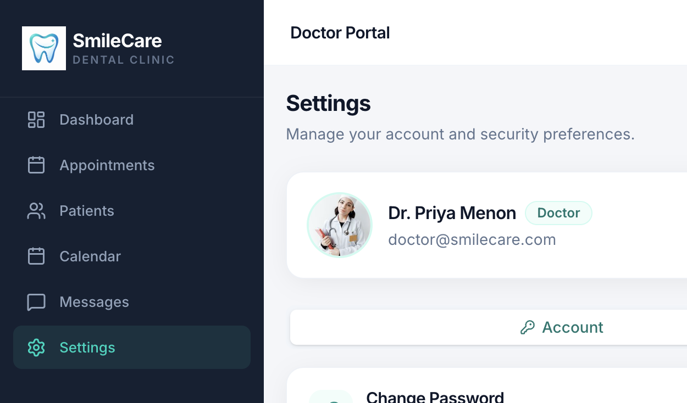

# SmileCare — Dental Clinic Platform

Full-stack dental clinic app with patient booking, doctor portal, and admin dashboard.

## Screenshots

### Public Website
| Home | Services | Booking |
|------|----------|---------|
|  |  |  |

### Admin Portal
| Dashboard | Appointments |
|-----------|--------------|
|  |  |

### Doctor Portal
| Dashboard | Settings |
|-----------|----------|
|  |  |

## Tech Stack

| Layer | Tools |
|-------|-------|
| Backend | Node.js, TypeScript, Express, Apollo Server, GraphQL, Prisma, BullMQ, Redis |
| Frontend | React, TypeScript, Vite, Apollo Client, Tailwind CSS |
| Database | PostgreSQL |

## Portals

| Portal | Login | Role | Demo Credentials |
|--------|-------|------|------------------|
| Patient | `/login` | `patient` | `patient@smilecare.com` / `demo123` |
| Doctor | `/doctor/login` | `doctor` | `doctor@smilecare.com` / `demo123` |
| Admin | `/admin/login` | `admin` | `admin@smilecare.com` / `Admin@12345` |

## Setup

**Backend** — copy `backend/.env.example` → `backend/.env`

```env
DATABASE_URL=postgresql://YOUR_USER@localhost:5432/smilecare
PORT=4000
ADMIN_EMAIL=admin@smilecare.com
ADMIN_PASSWORD=Admin@12345
```

**Frontend** — copy `frontend/.env.example` → `frontend/.env`

```env
VITE_GRAPHQL_URL=http://localhost:4000/graphql
VITE_PATIENT_ROUTE=/patient
VITE_DOCTOR_ROUTE=/doctor
VITE_ADMIN_ROUTE=/admin
```

## Run

```bash
cd backend && pnpm install && pnpm db:generate && pnpm db:push && pnpm db:seed && pnpm dev
cd frontend && pnpm install && pnpm dev
```

GraphQL → `http://localhost:4000/graphql`  
App → `http://localhost:5173`

## Docker

```bash
cp .env.docker.example .env
docker compose up --build
```
